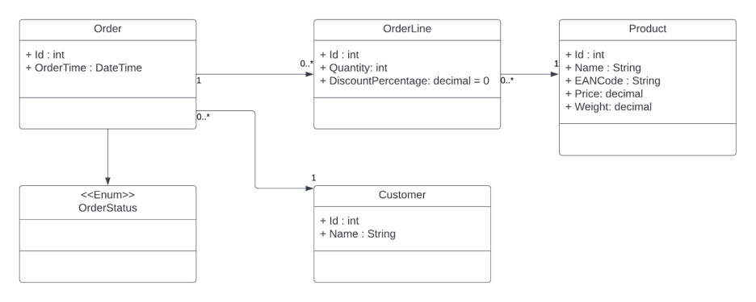

# Workshop: Building Your Own GraphQL Server in .NET 9 (Visual Studio Edition)

In this workshop, you will build a GraphQL server in .NET.

## Learning objectives

You will learn how to:
- Create a GraphQL server with query options.
- Create a basic GraphQL query to query the server.
- Connect the service to a database.
- Prevent overfetching of data from the database.
- Add filtering to the service.
- Add sorting to the service.
- Add paging to the service.
- Add mutation functionality to the service.

The entire workshop is divided into a number of steps. You should follow the steps in the indicated order. If you run into problems or have any questions, just ask Johan.

## GraphQL support in C#/.NET
Unfortunately, there is no native support for GraphQL in ASP.NET Core or any other part of .NET. There are some good open-source projects that allow us to build GraphQL servers in C#. There are 2 popular projects:
- HotChocolate (https://chillicream.com/docs/hotchocolate/v15)
- GraphQL.NET (https://graphql-dotnet.github.io/).

Both projects are very good for building GraphQL servers. HotChocolate has a somewhat better ASP.NET Core integration. Therefore we will use this project in this workshop.

## HotChocolate

HotChocolate can use three different approaches for building GraphQL Servers:
1. Implementation-first
2. Code-first
3. Schema-first

The first option requires the least amount of specific GraphQL code in your solution, while maintaining enough flexibility. During this workshop we will use this option.

## What are we going to build

During this workshop we are going to build a GraphQL server for a webshop. We will not build an entire backend because that would take too much time. In the workshop we will focus on just 4 entities for the webshop:
- Order
- Orderline
- Product 
- Customer

The relationship between these classes is depicted in the following class diagram:

## Prerequisites

To be able to build the GraphQL service, you need to have the Web workload installed in Visual Studio.

The code is based on .NET 9, so if you do not have this version installed, I would recommend doing this before starting the workshop.

## Get started

Well, let's start building the [GraphQL Server](./Step1.md).